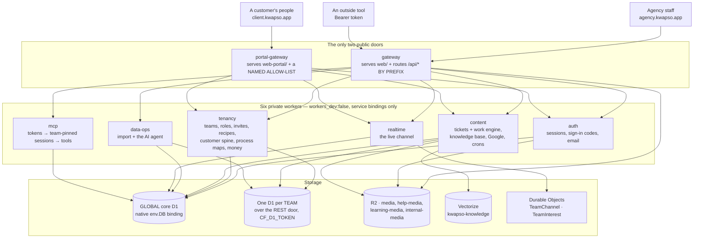
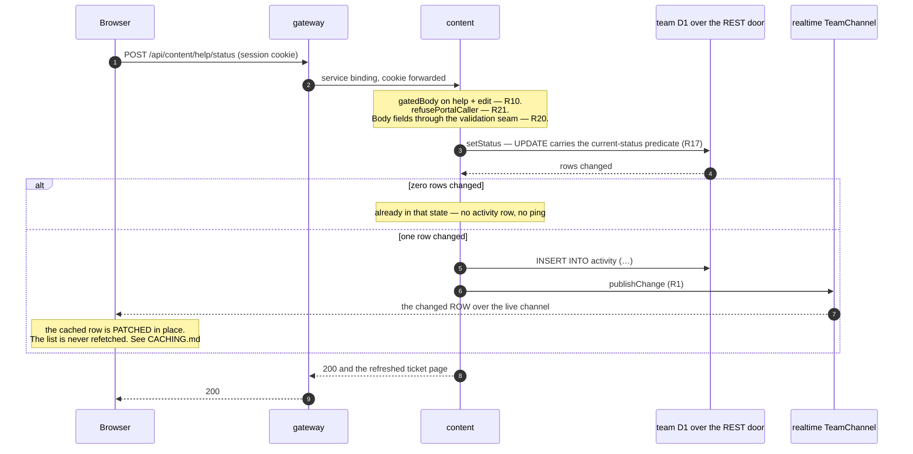

# The Kwapso System. Architecture (the 20 locked decisions)

The gateway is also the app's public address: it serves the web screens as
static assets AND routes /api/* to the domain workers (service bindings), so
screens and brains share one origin, login cookies work everywhere, including
installed iPhone apps.

Decided with the user on 2026-06-12 across 20 targeted questions. This is the
**master decision document**, every worker, table, and screen must follow it.
Do not relitigate any "LOCKED" item without the user.

> The Kwapso System is a real product meant to run at scale immediately. Never call it a
> "v1" or "MVP". Reference data model: the user's Glide "Base v3" exports
> (users, teams, team members, member roles, learning, help + help threads,
> invite logs, email change logs, all activity, selectable data + types,
> importable databases, data import sessions). That list is the EXPORT, not the
> app: learning is the one sheet with nothing behind it any more, the module was
> purged on 17 Aug 2026 (DATA-MODEL.md says what became of its material).

## 0 · The shape, in one picture

Everything below is written as tables and prose, which is where the detail
belongs. This is the same system drawn once, so a reader arrives with the shape
already in their head. **It is derived from the wrangler configs** — the service
bindings, the D1 bindings, the R2 buckets, the Vectorize index and the Durable
Object classes are each declared in `workers/*/wrangler.jsonc`, so if this
picture and a config disagree, the config is right.

**The three things the picture is for.**

1. **Two public addresses and no third.** Every other worker sets
   `workers_dev:false` + `preview_urls:false`, so no public route can reach
   `/internal/*`, the agent, or the act-as-user surface. `doc-claims.test.ts`
   derives that pair from the configs, so this is checked, not asserted.
2. **The gateways do not forward the same set.** `gateway` forwards **by
   prefix** and reaches all six; `portal-gateway` forwards a **named
   allow-list** and reaches four — it never binds `data-ops` or `mcp`. That
   asymmetry is why R21 exists: a client login is an ordinary team member at the
   *agency* hostname too, so every door must refuse a portal caller **at the
   door**, not by being left off a list.
3. **Two database tiers, reached two different ways.** The global core is a
   native `env.DB` binding; a team's own database is reached over the D1 REST
   door with `CF_D1_TOKEN`. That is what makes isolation physical rather than a
   query-discipline promise.

**And one request, end to end** — a staff member changes a ticket's status:

## 1 · Data, where things live (LOCKED)

- **Per-team databases.** A GLOBAL D1 core holds identity and everything that has
  to be true across teams: `users`, `teams`, `team_members` (the card catalog:
  user → team → role id), the session and sign-in tables, the MCP tokens, the AI
  meter (`agent_credits`, `agent_usage`, `agent_usage_log`), the error log, the
  sharding alarms (`db_alerts`, `db_growth`, `team_module_databases`,
  `team_module_moves`), `account_activity`, `email_change_logs` and the import
  registry. Every team then gets **its own D1 database** holding its own tables:
  roles + permissions, help + threads, invite logs, selectable data, activity,
  import sessions. Another team's rows are never in the same database, isolation
  by physics, not by query discipline.

  **[DATA-MODEL.md](DATA-MODEL.md) is the OWNER of the table list, and this is a
  summary, not the roster.** The list above names the *shapes* of thing that live
  globally so nobody reasons about the fence with the wrong mental model — a
  team's AI spend, its error rows and its growth alarms are global, not team-local.
  For which tier any given table lives in, read DATA-MODEL.md; a second
  step-by-step list here is exactly what §2 of this file already apologises for.
  The count on disk is derivable: `grep -h "CREATE TABLE" db/core/*.sql`.
- **Sharding machinery: PART-BUILT (2026-06-12), and the mover is LOCKED
  (2026-09-05).** A nightly cron sizes every database on the account and alarms
  at 80% of D1's 10 GB per-database cap AND at 80% of its 1 TB per-ACCOUNT cap
  (`db_alerts`, `db_growth`) — built, running, and the part to rely on. The
  **mover** relocates a heavy module's tables to its own database
  (`team_module_databases` routing) and its mechanics are correct and tested,
  but **its door refuses to run it** (`SPLIT_READS_WIRED` in
  `workers/tenancy/src/lib/sharding.ts`). This line used to say "reads merge
  across locations via `d1QueryAcross` + `resolveModuleDatabases`" as present
  fact. They do not: `requireMember` resolves ONE `guard.databaseId` from
  `teams.database_id`, nothing consults `team_module_databases`, and those two
  functions have no callers outside the sharding lib — so the mover's drain would
  empty the database the app is still reading and report success. And wiring them
  is not the whole job: `d1QueryAcross` refuses `LIMIT`, `ORDER BY` and `COUNT`
  across more than one database (a concatenation cannot answer them), while every
  collection here pages (R14), sorts and counts exactly (R16). Cross-shard paging
  is an owner-level decision, not a patch. The refusal and the flag are held
  together by a census in `workers/tenancy/test/merged-read-guard.test.ts`.
  Maintenance via x-admin-key endpoints.
- Every row: globally-unique, team-stamped IDs (rows can move homes without
  collisions). Every worker reads/writes through ONE data-access layer.

## 2 · The machine, workers (LOCKED)

Domain workers, each small enough for an AI agent to hold fully in its head.
**8 are built & on disk**, the six shared brains (auth, tenancy, realtime,
content, data-ops, mcp) under **TWO front doors**: `gateway` (the agency app,
`web/`) and `portal-gateway` (the client portal, `web-portal/`). `npm run check`
type-checks both front ends and all eight workers, then runs the full
unit/integration suite across every workspace.

**ONE ROSTER, AND IT IS NOT HERE.** What each worker owns, and, more usefully,
*why each one is its own worker*, is a table in
**[BASE-MANUAL.md §1](BASE-MANUAL.md)**. What each one BINDS, when its crons run
and which hostname it answers on is in **[OPERATIONS.md](OPERATIONS.md)**. This
section used to carry a third copy of both, and it is how the sentence below it
came to describe a fourteen-door allow-list that had grown to twenty-four: a
roster written in three places is a roster only one of which gets corrected.

What is LOCKED here is the shape, not the inventory:

| The decision | Why it is locked |
|---|---|
| **Split by DOMAIN, not by convenience**, each worker small enough for an agent to hold fully in its head | The unit of understanding is the unit of deployment. A worker you cannot read in one sitting is one nobody changes safely. |
| **Exactly TWO public doors**, `gateway` (agency, `web/`) and `portal-gateway` (client, `web-portal/`) | A third public address would be a third route onto `/internal/*`, the agent and the act-as-user surface. Everything else sets `workers_dev:false` **and** `preview_urls:false`. |
| **Neither door owns data**, both forward to the same gated routes | It is what makes the portal and the agency app two VIEWS of the same rows (SCOPE ch.04 "two front doors, one building") rather than two systems that drift. |
| **The agency door routes by PREFIX; the portal door by a NAMED allow-list** | The one structural difference between them, and the whole point of a second door: a prefix fan-out on a client-facing origin would publish every tenancy route, data-ops and `/mcp` to the client internet, each defended only by a role check. The allow-list is the door table in `workers/portal-gateway/src/index.ts`, the count lives there, never in prose. |
| **The planned `workers/config` recipe store was folded into `tenancy`** | It was one table and two routes hanging off the tenant spine. A worker for that would have been a deployment boundary bought with nothing. |

Both gateways are guarded by tests that derive their surface from code rather
than a list: `workers/portal-gateway/test/portal-door.test.ts` (every agency door
the portal does not name must 404) and `web-portal/test/portal-fence.test.ts`
(every read it does name is walked through to the lib function behind it, which
must carry the account fence).

### Durable Objects, code vs runtime, and how they scale (LOCKED 2026-06-15)

**The decision: a worker count and a Durable-Object count are different things,
and the runtime one is the only one that grows with teams.** Deployed code does
not scale with the tenant list; addressed instances do, without limit, and idle
ones hibernate for ~nothing.

The distinction itself, worker vs DO *class* vs DO *instance*, with the counts
and what each one costs, is explained once, in a table, in
**[DURABLE-OBJECTS.md §1](DURABLE-OBJECTS.md)**. It is not repeated here: this
section is the ruling, that document is the mechanism, and two step-by-step
accounts of one model are two accounts that can disagree.

What this section locks is the part that is a DECISION rather than a fact of the
platform, **what gets a DO instance, and what does NOT:**
- **Live channels, one channel per team AND one per user** (`TeamChannel`,
  addressed `team:<id>` or `user:<id>` by every publisher). A team change pings that
  team's channel (every active member); an identity / cross-team-membership /
  sign-out event pings that user's channel (their devices). Each ping is
  **row-level** (`{resource, id, op}`), NOT one-DO-per-record. *(Fact updated
  26 Aug 2026: "one channel" is no longer "one instance". Since §7's split of
  14 Aug 2026 a TEAM's channel is `REALTIME_SHARDS` (4) `TeamChannel` instances,
  `team:<id>#0…3`, plus one `TeamInterest` registry at `team:<id>!interest`; the
  realtime worker's `/publish` door owns the fan-out, so a publisher still names
  `team:<id>` and a listener joins the shard of `shardFor(userId)`. A USER's
  channel is still one instance. This bullet used to say "one instance per team",
  which was true when it was locked and is now the wrong shape to build against —
  address a shard, or publish through the door; a bare `team:<id>` instance has no
  listeners. DURABLE-OBJECTS.md §1–2 is the mechanism.)*
- **Transactional entity, one instance per *contended* thing** (an inventory
  cell, a ledger account, a booking slot), and ONLY where serialized
  read-modify-write matters. Reserved for hot counters/balances. Race-free
  because one instance handles its requests one at a time (single-threaded);
  apply the *operation* inside it ("decrement by 2"), persist before you ack;
  cross-entity transactions use a coordinator + idempotency keys.
- **Everything else = plain D1 rows.** Team name, member list, roles, a product's
  descriptive fields → written by a worker to the per-team D1, no DO. (Renaming a
  team is a D1 write + a channel ping; it does **not** get its own DO.)

**Scale + sharding:** DO instances are addressed by key and scale horizontally
*independent* of D1 sharding (which only decides where relational rows live).
Both scale by key to very large numbers; they're orthogonal. Client read-caching
on top follows [CACHING.md](CACHING.md).

> **That paragraph is about the NUMBER of instances, and it is only half the
> story.** Instances scale by key without limit; what does *not* scale without
> limit is **one instance's fan-out**, a channel broadcasts to its sockets
> serially, and a team is one channel. The measured ceiling and the decision to
> accept it are in **§7** below. Read that before proposing a fan-out change.

### The actions today (each becomes an MCP-catalogued tool)

> **UPDATED 2026-08-12. Read this table as the base's SHAPE, not as its census.**
> It lists the doors the base was designed around and is the right thing to read to
> learn what a door looks like here. It is **not** the live list and must not be
> trusted as one: the four domain workers today declare **224** routes between them
> (auth 15 · tenancy 76 · content 113 · data-ops 20), because the customer spine,
> process maps, the money, the work engine, the knowledge base, the agency's own
> housekeeping and the Google connections all shipped after this table was written.
> **The live list is each worker's own declarative `ROUTES` table**
> (`workers/<worker>/src/index.ts`), which is also what the seam checks read off
> disk, so it is the one that cannot drift. Two things below the families named here
> are worth knowing without opening the code: the client portal's own standing doors
> (`GET /api/tenancy/portal/context`, `POST /api/tenancy/portal/switch-account`) and
> the knowledge base's three (`GET /api/content/knowledge`, `GET
> /api/content/knowledge/ask`, `POST /api/content/knowledge/sync`). The middle one
> is the only READ in the fleet that can spend the team's AI allowance: `?compose=1`
> asks it to WRITE the answer out of the passages it found (R23), which gates on the
> `agent` module and meters like any other assistant turn. Finding the material
> stays free.

| Action | Worker | What it does |
|---|---|---|
| POST /api/auth/email/start | auth | send a 6-digit login code |
| POST /api/auth/email/verify | auth | check code, start session |
| POST /api/auth/email/change/start | auth | send a 6-digit code to the NEW email (signed-in) |
| POST /api/auth/email/change/verify | auth | check code → switch `users.email`, log it, sign out other devices, warn the old email |
| GET /api/auth/me | auth | who am I? |
| GET /api/auth/activity | auth | the caller's OWN account history (name/photo/email changes), identity-level, not team-tied |
| POST /api/auth/profile | auth | onboarding names + photo (R2) |
| POST /api/auth/logout | auth | end session |
| POST /api/tenancy/bootstrap | tenancy | accept invites OR create the personal team (+ its database) |
| GET /api/tenancy/teams | tenancy | my teams (switcher/home) |
| POST /api/tenancy/teams/update | tenancy | edit the active team's name + logo (teams:edit) |
| GET /api/tenancy/members | tenancy | the active team's members (+ identity + role) |
| POST /api/tenancy/members/role | tenancy | change a member's role (guards: not self, ≥1 admin); also emails the member a branded role-change notification via auth `/internal/send-email` (best-effort. See below) |
| POST /api/tenancy/members/remove | tenancy | remove (deactivate) a member; also emails the member a branded "removed from team" notification via auth `/internal/send-email` (best-effort. See below) |
| GET /api/tenancy/my-permissions | tenancy | the caller's own rights for the active team (drives the page-visibility guard) |
| GET /api/tenancy/roles | tenancy | the team's roles (+ member counts) |
| POST /api/tenancy/roles | tenancy | create a new role (starts with no rights) |
| POST /api/tenancy/roles/update | tenancy | rename / re-describe a role (not the locked Admin) |
| GET /api/tenancy/roles/permissions | tenancy | a role's permission matrix (tall sheet) |
| POST /api/tenancy/roles/permissions | tenancy | save a role's matrix (server re-applies auto-flip-read; Admin locked) |
| GET /api/tenancy/activity | tenancy | the team's activity feed, or one record's (`?scope=team\|user\|role\|invite&id=`) |
| GET /api/tenancy/invites/audit | tenancy | one invite's `invite_logs` audit (inviter snapshot + acceptance) for the detail (`?id=`) |
| GET /api/tenancy/team-meta | tenancy | the active team's Overview metadata (created by/when, last updated) |
| GET /api/tenancy/invites | tenancy | the team's invites (pending/accepted/revoked/expired) |
| POST /api/tenancy/invites | tenancy | invite by email to a role (branded email via auth) |
| POST /api/tenancy/invites/revoke | tenancy | revoke ("redact") a pending invite; also emails the invitee a branded "invite revoked" notification via auth `/internal/send-email` (best-effort. See below) |
| GET /api/tenancy/invitations | tenancy | invites the caller has RECEIVED (by email), the inbox; works for any signed-in user, not just teamless ones |
| POST /api/tenancy/invitations/accept | tenancy | accept one received invite → join + switch to that team (validates email-ownership + pending + unexpired; race-safe) |
| POST /internal/send-email | auth | send a branded email composed by another worker (service-binding only) |
| POST /api/tenancy/admin/migrate-teams | tenancy | roll team-schema migrations to every team DB (x-admin-key) |
| GET /api/tenancy/admin/db-sizes | tenancy | size check + open 80% alarms (x-admin-key) |
| POST /api/tenancy/admin/move-module | tenancy | the mover: relocate a module to its own DB (x-admin-key) |
| GET /api/content/help | content | list the team's tickets (`?scope=mine\|all`; `?id=` → one) |
| GET /api/content/help/thread | content | one ticket's reply thread, oldest-first (`?id=`) |
| POST /api/content/help | content | raise a ticket (`help:create`; always opens `open`) |
| POST /api/content/help/update | content | edit a ticket (`help:edit`) |
| POST /api/content/help/status | content | move along the fixed lifecycle (`help:edit`; raiser may reopen without it) |
| POST /api/content/help/reply | content | add a reply (`help:read`); @mention + raiser get a best-effort email |
| GET /api/data-ops/import/targets | data-ops | list active, code-supported import targets from the global catalog |
| POST /api/data-ops/import | data-ops | start a 3-stage import session (gated on the target's `create` right) |
| POST /api/data-ops/import/file | data-ops | upload CSV text; auto-map columns + build a preview |
| POST /api/data-ops/import/mapping | data-ops | adjust the column mapping; re-build the preview |
| GET /api/data-ops/import/preview | data-ops | the session's current preview (`?id=`) |
| POST /api/data-ops/import/confirm | data-ops | write every mapped row INSERT-ONLY through the gated create endpoint; one list-ping |
| POST /api/data-ops/import/batch(/file) | data-ops | start an agentic multi-file batch; attach a parsed CSV (AGENTIC-IMPORT.md) |
| POST /api/data-ops/import/batch/plan | data-ops | the agent builds the plan (targets, mappings, order, references). METERED on the credit pool |
| POST /api/data-ops/import/batch/confirm | data-ops | run the plan in dependency order; per-row report; one ping per changed module |
| GET /api/tenancy/roles/export · GET /api/tenancy/selectable/export · GET /api/content/brand-assets/export | tenancy/content | full-field CSV export (EXPORT NEEDS READ; team-bound) |
| GET /api/data-ops/import/sample | data-ops | a downloadable sample CSV for a target, a good-file template (AGENTIC-IMPORT §10) |
| GET /api/data-ops/import/batches | data-ops | the team's import history, newest first, summaries only (who, when, files → tables, totals) |
| POST /api/data-ops/admin/seed-targets | data-ops | seed the global import catalog (owner-only, x-admin-key) |
| POST /api/data-ops/admin/grant-credits | data-ops | top up a team's AI credits (owner-only, x-admin-key) |
| GET /api/data-ops/agent/usage | data-ops | the team's AI quota snapshot (free + credits) |
| POST /api/data-ops/agent/chat | data-ops | run one agent turn (answer, or propose/take an action act-as-you); accepts attached CSVs, planned through the import batch engine, run via run_import_batch behind the confirm panel (AGENTIC-IMPORT §8.5) |
| POST /api/data-ops/agent/confirm | data-ops | approve/decline a proposed dangerous action; resume the turn |
| GET /api/data-ops/agent/threads | data-ops | the caller's saved agent conversations |
| GET /api/data-ops/agent/thread | data-ops | one conversation's messages (`?id=`) |
| GET /api/content/google/connections | content | my own Google connections + the folders/spaces I share |
| GET /api/content/google/start · GET /api/content/google/callback | content | the consent round-trip for ONE service (the callback writes no row, it parks the code in the one-shot cookie) |
| POST /api/content/google/connect · /disconnect | content | keep the handshake (`google:create`) · stop using it + revoke at Google (`google:delete`) |
| GET /api/content/google/pick | content | the Drive folders / Chat spaces I could name |
| POST /api/content/google/sources · /sources/active | content | name a folder or space + say who may read it (private/team) · stop sharing one |
| GET /api/content/google/drive/files · /drive/file | content | files in the folders I named · one file's text |
| POST /api/content/google/drive/upload | content | write a file INTO a folder I named (`google:edit`) |
| GET /api/content/google/gmail/messages · /gmail/message | content | mail to/from a KNOWN CONTACT only · one message |
| POST /api/content/google/gmail/draft | content | leave a reply in my own Gmail drafts + hand back its link (`google:edit`) |
| POST /api/content/google/gmail/send | content | actually send it, `google:edit` **plus** the `google_mail` switch |
| GET /api/content/google/calendar/events | content | my own calendar, in a window. The ONLY calendar door besides the transcript read — the sync is one-way and nothing here writes to a calendar |
| GET /api/content/google/calendar/event/transcript | content | what was SAID in a meeting, reached from its calendar event |
| POST /api/content/meetings/sync-calendar | content | read Google's calendar INTO Meetings: the live window every call, plus one resumable slice of the whole calendar |
| GET /api/content/google/chat/messages · POST (same path) | content | one NAMED space's messages · post in it (`google:edit`) |
| GET /media/* | gateway | serve uploaded files from R2 |
| (WebSocket) /api/realtime?team= | realtime | join a team's live channel; receive row-level `{resource,id,op}` pings (gated by active membership of THAT team) |
| (WebSocket) /api/realtime?user= | realtime | join your OWN identity channel (account/membership events + forced sign-out); gated to your own id, open even when teamless |

## 3 · Tenancy & security rules (LOCKED)

- **One team session at a time** (Glide-style team-hop button on every page).
- **Every server request validates active-team membership + role rights.**
  A deep link to another team's record gets blocked/booted server-side,
  security is never just hiding UI.
  - *The reviewed exception (FLAGGED 2026-07-02; the predictable-key half CLOSED
    2026-08-10):* `GET /media/*` is served by **both** public doors — the agency
    gateway and the client portal's — **without a session check**, a deliberate,
    recorded decision (SCOPE ch.06 "Files": uploaded
    media stays on unguessable no-login links, exposure accepted in writing).
    R2 has no directory listing, so only someone holding a file's exact key can
    fetch it. **Every key is now unguessable**: one seam mints them
    (`mediaKey`, `shared/workers/image.ts`) as `<owner ids>/<random ULID>` —
    module media has always been `<teamId>/<ULID>`, and team logos + profile
    photos now carry the same random tail. They used to be `teams/<teamId>` and
    `users/<userId>` — DERIVABLE from an id anyone had already seen in a normal
    URL, which quietly made those two "no session" full stop. New uploads get
    the new shape; objects written under an old key stay reachable at it (a link
    already handed out keeps working, which is the decision's own bargain).
    **Both** doors validate the key at the boundary through the one shared
    validator (`safeMediaKey`, `shared/workers/image.ts`), so a probe with a
    dot-segment, a space or a control character gets a plain 404 — the same plain
    404 a genuine miss gets, on the agency origin and the client origin alike.
    One validator, two doors: a guarantee that held on only one of them would be
    no guarantee at all.
    **This is a capability-URL model, not a gated read**: anyone holding a link
    keeps it, with no expiry and no revocation. Fine for photos, logos and
    how-to screenshots; NOT fine for invoices, contracts, ID documents or
    anything a regulator calls personal data — a product storing those must add
    a session + membership check or short-lived signed URLs BEFORE launch
    (BASE-MANUAL §5, "Two REASONED exceptions").
- **Deep-link access story (UPDATED 2026-06-21).** Deep links now use the
  `/t/<teamId>/<module>/<id>` grammar, rendered by the screen engine. A deep link
  to a team you are **NOT** a member of does **NOT** switch your active team, the
  server refuses the switch, so there is **no partial switch**; you see a
  no-access screen. A logged-out hit on a deep link → login. (The old
  `/settings/team` + `/settings/team/member` routes are RETIRED/deleted; top-level
  `/members` and `/roles` are thin redirects to `/t/<teamId>/members` and
  `/t/<teamId>/roles`. In-shell navigation uses the History API, never the
  framework router. See CACHING.md "Navigation never reloads".)
- **Block at every step (LOCKED 2026-06-21).** `?panel` / `?confirm` overlays are
  permission-gated on open (client) AND each action re-checks `requireRight` on the
  SERVER, so the guarantee is never UI-only.
- **Permissions: tall sheet** per team, `role | module | read/create/edit/delete`.
  New module = new rows, never a schema change. Members point at one role;
  editing a role applies instantly to every holder.
- Any write right (create/edit/delete) **auto-flips READ on**, visibly.
- The enforcement seam is BUILT, it lives in **`shared/workers/gating.ts`**
  (requireMember + requireRight reading the tall sheet; the ONE seam every
  worker uses, `workers/tenancy/src/lib/permissions.ts` is a thin re-export
  kept for old imports), every module endpoint starts with it the day the
  first module lands.
- **Export needs READ only. Import needs CREATE.**
- Default roles seeded per team: **Admin** (locked, full rights) + **Viewer**
  (read-only). Default selectable-data values seeded on team creation.

## 4 · Records & history (LOCKED)

- Every table carries the audit block: created/edited/deactivated timestamps +
  actor id/email/name snapshots (exactly like Base v3).
- **Master records are NEVER hard-deleted**, deactivate/activate only.
  The delete right stays in the grid for future child-table cases.
  *(Fact updated 26 Aug 2026, twice.)* **First: the anticipated child-table case
  arrived.** A process STEP added by mistake can be hard-deleted (owner's explicit
  decision, 25 Aug 2026) through `POST /api/tenancy/processes/steps/delete`, gated
  `processes:delete` — so "base modules don't expose it" is no longer absolute.
  The door is as careful as the rule it narrows: three named refusals (a step in
  an older version, a step any agreed version holds, a step a live step loops back
  to), each re-checked as a predicate riding the DELETE itself; the step's
  revisions go with it; an activity row ("Step deleted") is written; and a portal
  caller is refused at the door. Master records — the process, the app, the
  account — still deactivate, never delete. **Second, the words:** this line used
  to add "not archive", and the glossary has since (2026-08-19) defined
  **Archive** as its own term, deliberately distinct from deactivate ("put a
  record away without losing it"), which tickets and apps now ship. Whether this
  lock's word-ban stands narrowed or falls is an owner decision still to be made;
  both facts are recorded here rather than one silently deleted.
- **Activity log records meaningful changes**, created, edited, role changed,
  invite sent/revoked, member removed (a removed member is deactivated, never
  deleted — and the one hard delete, the step carve-out above, writes its own
  activity row rather than escaping the log). One reusable writer
  (`shared/workers/activity.ts`) writes to each team's own `activity` table; each
  row carries a relation (`related_table`/`related_row_id`) so the SAME feed
  surfaces four ways, the whole team, one user, one role, or one invite.
- **Every record screen has an Overview tab + an Activity tab** (LOCKED
  2026-06-17): Overview = the audit block (created/edited/deactivated + who);
  Activity = that record's slice of the log. Both tabs render from LIBRARY
  collections (`RecordDetail` / `DescriptionList` / `ActivityFeed`, now in
  `shared/ui/`) through the screen engine. Never a hand-built app
  component (UI comes from the library, §6). See the activity read path in
  `workers/tenancy/src/lib/activity-read.ts`.
- Race-safety for invariant writes follows [CONCURRENCY.md](CONCURRENCY.md);
  failures follow [ERROR-HANDLING.md](ERROR-HANDLING.md).

## 5 · Users, onboarding, invites (LOCKED)

- Sign-in: a 6-digit email code (Resend sends ALL email) **or Google**, two ways to prove ONE
  identity, never two accounts. All user data lives in OUR database; no auth vendor holds anything.
  - **Google was parked on 2026-06-12** and its `users.google_sub` column dropped (`db/core/0003`).
    That was **the Kwapso System's** scope decision ("strict email-OTP only") for the generic base, not a
    security finding. kwapso's SCOPE re-decides it: ch.03 names `kwapso-auth` as "OTP + Google
    sign-in", ch.06 says "email one-time code … or Google — same person as long as the email
    matches", and SCOPE wins where it speaks. Rebuilt 2026-08-11 **without** re-adding `google_sub`:
    the verified email IS the identity, so both doors go through the one seam
    (`findOrCreateUserByEmail`) and a person who used a code yesterday and Google today is one row.
    `db/core/0003` is NOT reverted and carries a comment pointing here, so a reader who finds the
    June migration can follow the trail forward instead of concluding Google is off. **The generic
    Kwapso System base upstream may still be email-only** — kwapso is the fork that turned it back on, and a
    future fork of the base inherits whatever the base says, not this decision.
  - The flow is the OAuth **authorization-code** flow with PKCE (`GET /api/auth/google/start` →
    Google → `GET /api/auth/google/callback`), not the Identity-Services button: that button POSTs
    its credential cross-site from `accounts.google.com`, which `refuseForeignOrigin` refuses at
    both front doors, and loosening that check is not a trade worth making.
  - **Google's assertion is verified server-side**. RS256 signature against Google's published
    JWKS, plus issuer (by exact match, never `.includes`), audience, expiry and `email_verified`.
  - **Two redirect URIs**, one per front door (`<agency>/api/auth/google/callback` and
    `<portal>/api/auth/google/callback`); the worker will bounce a person back to those two origins
    and nothing else, so the callback can never become an open redirect carrying a session cookie.
  - **Signing in still is not getting in**: a Google account nobody invited gets exactly what a
    stranger typing a code gets — a teamless user row and the "nothing here yet" screen.
- **CONNECTING a Google account is a different question from signing in with one (BUILT 2026-08-12).**
  Sign-in asks Google "who is this?" and keeps nothing. A CONNECTION asks for Drive, Gmail, Calendar
  or Google Chat and keeps a refresh token, so it is a **second OAuth app** (`kwapso sync`,
  `GOOGLE_CONNECT_*` on the CONTENT worker), consented **one service at a time**, and stored **per
  person**. There is no team-wide service account and nowhere to put one: the row hangs off a user
  id, so "connect the agency's Drive once and let everybody read it" is a column that does not exist.
  - **What each connection can see is narrowed at Google, not by our filter.** Drive is the FOLDERS
    the person named (`google_sources`), Chat is the SPACES they named, Gmail is only mail to or
    from an address on one of the team's accounts (the query is built from `accounts.email` and the
    caller's words are ANDed inside it), Calendar is their own. Every empty case answers with
    NOTHING rather than everything — the three fences are run, not read, in
    `workers/content/test/google-fences.test.ts`.
  - **Every source declares its SHELF at the moment it is shared**, `private` (this person alone)
    or `team` — because "who will be able to read this?" is the question a person is actually
    answering when they share a folder, and answering it later is answering it wrong.
  - **Tokens are ciphertext in the column** (AES-GCM, `GOOGLE_TOKEN_KEY`), not merely on Cloudflare's
    disk: the team database is reachable by anything holding the account's D1 REST token.
  - **Two permission switches, not one**: `google` (may connect an account, and use it), plus
    `google_mail` (kwapso may SEND mail as you) — separate from the `agent` right, so granting
    somebody the assistant does not grant the assistant their outbox. The act switch is demanded of
    a person pressing "send it from kwapso" exactly as it is of the assistant: same act, same
    mailbox, same permission.
  - **THE CALENDAR IS READ-ONLY (LOCKED 2026-08-18).** kwapso reads a calendar and never writes one.
    The owner: *"disable the ability to create, edit, or delete anything in the calendar from the
    frontend… just make it one-way so we only grab and update the information."* Seven doors, five
    library functions, eight tools and a third permission switch (`google_events`, "Calendar on your
    behalf") went together, so the refusal is a MISSING FUNCTION rather than a condition somebody can
    invert — the same shape R24 uses for internal money. **And the GRANT now says the same thing
    (2026-08-19):** the app asks Google for `calendar.readonly`. That was the owner's decision and it
    cost what OPERATIONS.md said it would — every connected person back through a consent screen —
    because a grant at Google is an additive SET per OAuth client, so a narrower ask alone changes
    nothing for somebody who already approved the wider one. Three things make the narrowing real,
    and `workers/content/src/lib/google-oauth.ts` holds the essay: disconnect REVOKES at Google
    (the only act that empties the set), connect forces a fresh consent and refuses incremental
    authorisation, and the token response's granted scopes are read back and compared against the
    ask, so a grant that came back wider than requested is shown on the person's own settings card
    instead of being assumed away. `workers/content/test/google-scopes.test.ts` locks all four.
  - **The bin, never a delete.** Everything kwapso writes into Google it can take back, and only
    into a bin: a Drive file, a Chat message, and (2026-08-19) a Gmail draft, message or whole
    conversation. Reversible for thirty days, restored in one click. A permanent delete is
    unreachable rather than un-built — it needs the full `https://mail.google.com/` scope, which
    this app does not ask for on any surface, so the promise is kept at Google.
  - **Mail always asks.** A reply is written into the person's own Gmail DRAFTS with a link straight
    to it, and a "send it from kwapso" button beside it. The confirm rule lives on the agent tools
    and is pinned by a test. (Its other half used to be "calendar entries do not ask"; there is no
    calendar write left to ask about.)
  - **NO client-portal exposure of any of it.** The portal gateway forwards none of these doors and
    every handler opens with `refusePortalCaller` — enforced path-shaped, not permission-shaped, by
    `workers/content/test/google-doors.test.ts` (R21's own derivation reads the Client role's rights
    and so walks past a module no client role holds).
- Onboarding: first name, last name, optional photo.
- Invites are by email, with a shelf life. At onboarding, **all active invites
  auto-accept** (the user lands in those teams). A personal "Chris' team" is
  auto-created **only if there are no active invites**.
- **Member-notification emails (LOCKED 2026-06-21).** A member is emailed when
  their role changes, they are removed from a team, or their pending invite is
  revoked, a branded email (shared `brandedEmail` template) via auth
  `/internal/send-email`. **Best-effort:** the STATE CHANGE commits first and is the
  authority; a failed/bounced email is logging-only and NEVER rolls it back (same
  pattern as best-effort activity writes in §4). (email-change already warns the
  old address, §2 auth.)
- **Invitations inbox (BUILT 2026-06-18).** An ALREADY-onboarded user (who has a
  team) is not covered by the onboarding auto-accept, so they get an in-app
  **inbox** (`GET /api/tenancy/invitations` by their email; reachable from the
  team switcher, the top of Settings, and the `/invitations` route the invite
  email deep-links to). Accepting (`POST .../invitations/accept`) **joins +
  switches** to that team. This makes an invite recoverable even if the email
  never arrives, no invite is ever a dead end.

## 6 · App shell (LOCKED)

- **PWA, online-only, install prompt BUILT (2026-06-18).** The app ships a web
  manifest (`web/app/manifest.ts`, name/description from `shared/brand.ts`) +
  brand-monogram icons (`web/public/icons/*`, swappable via `brand.logoUrl`) +
  per-mode `theme-color`, so it is installable to a home screen / dock. A library
  bottom `Sheet` (`web/components/install-prompt.tsx`) drives it: Chrome / Edge /
  Android use the captured `beforeinstallprompt` (a real "Install" button); iOS
  Safari (which fires no such event) gets the guided "Share → Add to Home Screen"
  walkthrough. **Trigger rules:** never when already installed; never on a
  browser that can't install (don't nag where the action is impossible); show
  once on the first visit (any page), then only on the **login page** and at most
  once per **14 days** after a dismissal (a dismissal or install stamps the
  cooldown, kept in `localStorage`). No service worker, online-only;
  installability is manifest-based (Chrome ≥90 needs no SW). A reusable
  `pwa-install-prompt` library collection is flagged in UI-GAPS.md for later.
- **Mobile is not desktop-shrunk (LOCKED 2026-06-18).** Controls placed
  side-by-side on desktop must NOT blindly stay side-by-side on mobile. The rule
  in full, and the reason it is a rule, lives in
  [UI-CONVENTIONS.md](UI-CONVENTIONS.md) §4, "Mobile is not desktop-shrunk",
  beside its twin (action-button rows never clip). It is written down HERE as a
  locked decision and THERE as the convention you apply; it is not in the
  library's own rule-book, which governs the library, not this app.
- **UI comes ONLY from the component library, and the library is a PINNED
  dependency vendored IN this repo (CHANGED 2026-08-22; updated 26 Aug 2026: the
  kit became a pinned dependency on 25 Aug).** It is `shared/ui/`, imported as
  `@shared/ui/…` — `github.com/Kwapso/kwapso-ui-ux` at the tag in
  `shared/ui/VERSION.json`, pulled by `scripts/sync-design.mjs`.
  Until 2026-08-22 it was the npm package `@kwapso/ui`, installed from a separate
  repository the owner deployed, and this line read "gaps go INTO the library
  first". It was vendored because the app is being re-themed to the kwapso
  design kit, and a theme is only most of a re-skin: a token remap repaints a
  button, it cannot change the button's SHAPE, and the kit's secondary button is
  a filled button with no border in any state. **The decision itself is
  unchanged** — screens are assembled from library lego, never from one-off
  components invented in `web/`, and a control that is specific to this app
  still belongs in `web/components/`. What changed twice is who closes a gap: it
  used to be a written request to another repo on somebody else's release schedule
  (UI-GAPS.md is that list, and it still names the open ones); for three days it
  was work this repo could do in the same commit; and since 25 Aug a kit change is
  made upstream in `Kwapso/kwapso-ui-ux`, tagged, and pulled — a hand-edit under
  `shared/ui/` turns the build red (`web/test/vendored-kit.test.ts` recomputes the
  content hash). See `shared/ui/README.md` for the rationale in full.
- Anti-bloat is law: one master copy of every rule/doc/component; reuse over
  recode; keep every piece small enough for an agent to reason about.

## 7 · Scale, the live layer's ceiling, and where it now sits (LOCKED 2026-08-14)

**History, because this decision was made twice.** The twelve-dimension scaling audit
of 14 Aug 2026 scored the base 78/100 (79 once the growth alarms were delivered), and
its largest single gap, the whole of dimension 9, *was* the decision recorded in §2:
one `TeamChannel` per team, broadcasting serially. That ceiling was first **accepted**,
on the grounds that it sat about seventy-five times above what this deployment peaks
at. The owner then chose to raise it instead. Both were reasonable; this section records
where it ended up and what is still true.

**The change (14 Aug 2026).** A team's channel is now **split across
`REALTIME_SHARDS` (4) objects**, and listeners **declare what they want to hear**.

- **The split lives in the realtime worker's `/publish` door**, not at the publishers.
  A publisher still makes one call naming `team:<id>`; the door fans it out to
  `team:<id>#0…3`. All hundred-odd `publishChange` call sites are untouched, which is
  the point, a fan-out written at the publisher would have been a hundred chances to
  write it differently. Listeners join the shard of `shardFor(userId)`, so one person's
  devices land together and a reconnect returns to the same object.
- **Subscriptions narrow the sends.** The socket URL carries `?sub=`, the DO keeps it
  on the attachment beside the fence, and a broadcast skips a socket that did not ask
  for that resource. The client portal now asks for **twelve** resources (26 Aug 2026: `processes` and `account_rates` joined with the account stamp) instead of
  everything (`PORTAL_SUBSCRIPTIONS.length`, counted 26 Aug 2026), derived from
  `PORTAL_LISTENERS` so the two cannot drift.
- **The two filters fail in OPPOSITE directions, on purpose.** The fence decides what a
  listener MAY hear: resolved from their session, never read off the URL, fails
  **closed**. The subscription decides what it WANTS to hear: declared by the client,
  fails **open**. That is why one is safe to take from a request and the other is not,
  and why a client on an older build, sending no subscription, is over-served rather
  than silently starved.
- **The agency app is deliberately NOT narrowed.** Its shell refreshes the team
  activity feed on *any* resource, so a derived subscription would have made that feed
  stale for every resource outside the two listener maps. A narrowing that cannot be
  proved complete is a screen that goes quietly out of date, which is the failure shape
  with no symptom. It stays un-narrowed until the feed listens for something narrower.

**WHERE THE CEILING NOW SITS, and the arithmetic, because the honest answer is not
"solved".** Wall-clock per broadcast falls by the shard count, so the per-object
listener ceiling goes from ~3,000–5,000 to roughly **12,000–20,000 per team** — the
same worst-case arithmetic as the table below, every ping reaching every shard, so
interest routing can only raise it. But the
work is `publishes/second × sockets × per-socket cost`, and sharding divides only by N
*(fact updated 26 Aug 2026: the table below assumes every ping reaches every shard,
which stopped being true when interest-routing shipped in August 2026 — see the
paragraph after it. The rows stand as the worst case, not the live arithmetic; they
have not been recomputed here)*:

| shards | sockets/shard at 25,000 | CPU-seconds per second, per shard |
|---|---|---|
| 1 | 25,000 | ~130, over by 130× |
| **4 (today)** | **6,250** | **~33, over by 33×** |
| 8 | 3,125 | ~16 |
| 128 | 195 | ~1, and now the *publish* side is the bottleneck, at ~22,000 object calls/second |

So at a base yardstick of 250,000 people in ONE tenant (~174 publishes/second),
**sharding alone does not get there and cannot**: it would take ~128 shards, at which
point every ping costs 128 object calls and the cost has simply moved. Reaching that
scale needs a different shape, routing a ping only to shards holding interested
listeners, instead of broadcasting every ping to every shard. *(Fact updated
26 Aug 2026: that shape WAS built, in August 2026 — the lever this section said
would wait for yardstick scale was pulled early. `TeamInterest`, a second Durable
Object class in the realtime worker, keeps a per-team registry of which shards hold
a listener for which resource, and the publish door asks it before fanning out; a
stale or unknown answer says yes, so a wrong entry costs an extra send, never a
missed one. DURABLE-OBJECTS.md describes it. The remaining lever is
`REALTIME_SHARDS`.)*

**What it means for kwapso: comfortably solved, with four times the margin it had.**
The estate ([glide/RECONCILIATION.md](../glide/RECONCILIATION.md) §3, confirmed with the
owner 14 Aug 2026) is 20 client companies, 104 contacts, 6 staff, about 125 rows in
`accounts`. Realistic peak is ~40 concurrent sockets; every human it works with, at
once, on three devices each, is ~350. Against 12,000–20,000 that is 300× and ~40×.

**The signal to revisit, specific, and observable today.** Nothing measures concurrent
sockets, so do not go looking for that metric. These three are real:

1. **The roster, which is countable.** `team_members` + `portal_users` on one team
   passing **~12,000 rows** (was ~3,000 before the split). Concurrency is a fraction of
   the roster. Today it is about 110.
2. **Cloudflare's Durable Object metrics** (dashboard → Workers → Durable Objects →
   `TeamChannel`): any single instance sustaining **>200 requests/second**.
3. **A change of shape, which arrives with no number moving:** the base hosting a second
   agency of its own, or client contacts being expected to keep the portal open all day
   rather than visiting it. Either turns "occasional visitors" into "concurrent
   sessions", which is what the numbers above rest on.

**When one fires, in order:** raise `REALTIME_SHARDS` (one line, and the client and the
fan-out read the same constant so they cannot disagree); then narrow the agency's
subscription, which needs the activity feed to listen for something narrower than
"anything". The third step this list used to end with — route pings to interested
shards rather than to all of them — was built in August 2026 (`TeamInterest`; fact
updated 26 Aug 2026), so it is already working before either alarm has fired.

**THIS IS ABOUT THIS DEPLOYMENT, NOT ABOUT THE BASE.** The Kwapso System is reusable and the audit
scored it against a base's yardstick. A fork whose one tenant is a company rather than
an agency meets the arithmetic in that table for real. See
[BASE-MANUAL.md](BASE-MANUAL.md) §5. A fork's first architectural question is whether
its largest tenant is a few hundred people or a few hundred thousand.

**Other dimensions still held down, with the trigger that reopens each:**

| accepted | why it stays | the trigger |
|---|---|---|
| Base64 uploads through the worker (not presigned direct-to-R2) | changes the client contract *and* the capability-URL model SCOPE ch.06 records | a file cap above ~25 MB, or the 128 MB isolate budget being hit in practice |
| ~~The module mover is one non-resumable request~~ **RESUMED 2026-08-17** | progress lives in `team_module_moves` (db/core/0023), not in a stack frame: bounded copy batches per call, a per-table cursor, an idempotent `INSERT OR IGNORE`, and a claim a killed Worker cannot strand. A killed call is continued by calling again, and routing is still flipped last so an interrupted move is never a doubled read. | the FIRST real move, the resumption logic is unit-proven against an in-memory D1, never against Cloudflare's |
| No cross-shard merge (`d1QueryAcross` refuses a paged or counted read across shards) | nothing paged is on the split path, and refusing beats answering wrongly | the first time a PAGED module has to be split |
| The crons rotate their team window rather than queueing | rotation makes a late team late, not skipped | more than ~600 teams |
| R16's exact `COUNT(*)` on every feed page | it is a **Law** (RULES.md), changing it means rule, registry and check together | an activity table past ~5M rows in one team |
| ~~Per-caller rate limiting on ordinary doors~~ **BUILT 2026-08-17** *(fact updated 26 Aug 2026: this row used to record the limiter as held down)* | the reasoning that kept it out of the gateways stands — neither decodes a session, so neither can key a limiter on a user, and per-IP puts one office behind one bucket — so it sits where the caller is already known: `teamContext` (`shared/workers/gating.ts` → `shared/workers/rate-limit.ts`) checks `callerHasBudget` once per request, keyed on the resolved user id, `CALLER_REQUESTS_PER_MINUTE` (600, `shared/workers/limits.ts`) per caller per worker, before the membership read, failing OPEN (a broken safety valve must not become the outage). The `CALLER_LIMIT` binding rides tenancy, content, data-ops and mcp (the `/mcp` desk keys `machine:<user_id>` so a token loop is refused before it fans out) | a paid tier where a caller's cost is somebody else's bill (the number, and where it sits, get renegotiated) |

The growth alarms **are** delivered (`ALERT_TO` on tenancy, one mail per tick, once per
new alarm), [OPERATIONS.md](OPERATIONS.md) § *Growth watch*.
