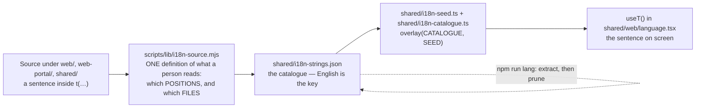

# LANGUAGES.md. The app speaks four, and this is how

**This document owns the translation capability.** Before it existed, four Laws
governed translation (R28, R33, R34, R44), `npm run lang` was mandatory before a
commit, both deploy scripts refused on a stale catalogue — and the mechanism was
explained only inside RULES.md's law rows. RULES.md is the law-book, which is
the wrong altitude for a mechanism: a law says *what must be true*, not *how the
thing works*. So a developer sent to UI-CONVENTIONS.md to add a screen walked
past every document that would have told them a new sentence has to be wrapped
and catalogued, and R28's own text names the consequence — the sentence "ships
in English to somebody who chose German, silently, on a screen that looks
finished."

> **The one-line version.** Write the whole English sentence inside `t("…")`,
> run `npm run lang`, commit both. Everything else here is why.

---

## 1 · What the app speaks, and who decides

`LANGUAGES` in **`shared/i18n.ts`** is the single place a language is declared:

| code | English | native | |
|---|---|---|---|
| `en` | English | English | 🇬🇧 |
| `de` | German | Deutsch | 🇩🇪 |
| `es` | Spanish | Español | 🇪🇸 |
| `ca` | Catalan | Català | 🇦🇩 |

Two properties of that array are load-bearing:

- **`en` is not a translation, it is the KEY.** The English sentence in the
  source is the lookup key for every other language. That is why a missing
  translation degrades to English on screen rather than to a blank or a crash —
  and it is also why a sentence missing from the catalogue is invisible: it
  still renders, in English, to somebody who chose German.
- **`native` is what the switcher shows.** Somebody looking for their own
  language scans for the word *they* call it, not the English name of it.
  `english` is what the machine translator and the assistant are told to write in.

`TRANSLATED_LANGUAGES` is derived from `LANGUAGES` by dropping `en`, so adding a
language is genuinely one edit — but see § 6, because two files ACCUMULATE
rather than derive, and that is the fourth failure R28 was earned by.

## 2 · The pipeline, end to end

**One definition, read two ways.** `scripts/lib/i18n-source.mjs` answers two
questions, and both are derived rather than listed:

- **Which POSITIONS a person reads** — the seven: `jsx-text`, `jsx-child`,
  `attribute`, `property`, `field-label`, `toast`, and `t-call`. The last one is
  what keeps the pair honest: without it, wrapping a string in `t(...)` would
  delete it from the extraction, the catalogue would lose its key the moment the
  call site started using it, and the app would quietly return to English under
  a green build.
- **Which FILES are walked** — `appFiles()` follows **the front doors' own
  import closure**. A file is walked because a front door imports it, not
  because of the folder it sits in. That distinction was earned:
  `formatRelative` in `shared/web/` had been saying "5d ago" in English to nine
  call sites on both front doors, next to a German sentence, for a year.

R28 reads that definition forwards (*does the catalogue match the code?*); R33
reads it backwards (*does every position the walk reports sit inside a `t(...)`?*).

## 3 · What you must actually do

**Adding or changing a user-visible sentence:**

1. **Write the whole sentence inside `t("…")`.** `const t = useT()` — the hook
   is in `shared/web/language.tsx`.
2. **Run `npm run lang`** (extract, then prune) and commit the catalogue change
   with the code change. `npm run lang:check` is the read-only version; both
   `npm run deploy:staging` and `npm run deploy:production` run it and refuse on
   a stale catalogue.
3. **Use the glossary's word** (`shared/glossary.ts`), never a synonym for it —
   R34 reads the catalogue for known synonyms, so a word the glossary already
   owns fails the build under a different name.

**Never run `scripts/i18n-translate.mjs` yourself.** It spends the owner's own
API key per run. Extraction is free and is what the gate needs; translation is a
separate, deliberate act. `scripts/i18n-translate-workers-ai.mjs` is the
key-free alternative.

## 4 · The three shapes that go wrong

**`t("of")` — a fragment.** A call site may not disagree with the definition:
`t("of")` declares a string to be copy that `isUserVisible` refuses, so it is
translated **nowhere**, catalogued nowhere, and flagged by nothing.

**What `isUserVisible` actually is**, since three laws stand on it and it is
named in five documents. One function, `scripts/lib/i18n-source.mjs`, and it
answers ONE question — is this string a sentence a person reads? It says no to
seven shapes, in this order: shorter than two characters; no letter in it at all;
anything starting `/` or containing `://` (a path or a URL); anything opening on
`. , ; : % ) ] } & — – … ' ’` (a fragment that begins mid-sentence); a bare email
address; a kebab, snake or dotted identifier (`help-thread`, `team_id`,
`a.b`); and a lowercase run of three characters or fewer — which is what
actually refuses `"of"`, and `"en"`, `"de"` and `"px"` with it. Everything else
is copy. The consequence is the point: a string it refuses is invisible to R28,
R33 and R44 together, so it ships in English with nothing red anywhere. That is
why the fix is always to widen the STRING into a whole sentence, never to argue
with the predicate. Write the whole sentence with a
`{hole}` in it — `t("Page {page} of {total}")` — which is also the only shape a
translator can reorder, because word order is not the same in four languages.

**A field config's `label:`.** `t` is a hook and a field config is a
module-level constant, so those words genuinely cannot be wrapped where they are
declared. They are translated on the way to the screen by
**`shared/web/field.tsx`**, positionally, and that route is held shut by an
import ban on the library `Field` — go through the seam or the build goes red.

**A copy TABLE read back through `t` elsewhere.** Legitimate, and it is data in
`TRANSLATED_WHERE_READ` naming the call that reads it, rot-checked.

## 5 · Two ways the catalogue rots, and what each costs

| shape | what it is | what it costs |
|---|---|---|
| **MISSING** | a sentence the app says that is not in the catalogue | it ships in English to somebody who chose German — silently, on a screen that looks finished. English is the key, so nothing errors |
| **ORPHAN** | a catalogue entry matching no string in the app | nothing breaks today, which is why it rots — into a record of what the app *used to* say, translated on every build |
| **UNREACHABLE** | a file under `web/`, `web-portal/` or `shared/` that says something and that the walk never opens | the same as MISSING, with nothing to grep for. Censused off the DISK, not off the graph; a reasoned `UNWALKED_OK` line is the only way out |
| **UNANSWERED** | a string extracted and wrapped, with no entry for a translated language | English on screen. Bounded rather than banned — see § 6 |

## 6 · The ceiling that can only fall (R44)

R28 makes the catalogue match the code. R33 makes the code ask for its
translation. **Neither asks whether the asking is ever answered.** A string can
be extracted, wrapped, and still have no entry in `overlay(CATALOGUE, SEED)` for
a translated language.

So per translated language, the count of extracted strings with no non-empty
entry is pinned in `TRANSLATION_CEILING` (`shared/rules/registry.ts`). The check
recomputes the true count fresh and requires **exact equality**: a string shipped
past the ceiling fails the build, and a ceiling left *above* the true count after
a translation lands fails it too. **The pin can fall and can never rise without
the count behind it rising first.**

It is deliberately not a hard zero. A missing translation degrades to English,
which is a sentence rather than a bug — and a hard zero would turn the next
ordinary feature PR red the moment it adds one label. A build that fires on
unrelated work is a build people route around, which hides the next real
regression behind the routine one.

**And the fourth failure: a language the app no longer speaks.** `LANGUAGES` in
`shared/i18n.ts` is the only place a language is decided for everything DERIVED
from it — and never for the two files that ACCUMULATE. A translation left on
disk for a dropped language is dead weight that reads as current. `npm run lang`
prunes; run it before you commit.

## 7 · Where each piece lives

| Thing | File |
|---|---|
| Which languages the app speaks | `shared/i18n.ts` (`LANGUAGES`) |
| What a person reads, and which files are walked | `scripts/lib/i18n-source.mjs` |
| The catalogue | `shared/i18n-strings.json` |
| The overlay the screen reads | `shared/i18n-catalogue.ts` + `shared/i18n-seed.ts` |
| The hook | `shared/web/language.tsx` (`useT`) |
| The field-config seam | `shared/web/field.tsx` |
| The switcher | `shared/web/language-menu.tsx`, `language-section.tsx` |
| Extract / prune / gaps | `scripts/i18n-extract.mjs`, `i18n-prune.mjs`, `i18n-gaps.mjs` |
| The ceiling | `TRANSLATION_CEILING` in `shared/rules/registry.ts` |
| The laws | [RULES.md](../RULES.md) R28, R33, R34, R44 |
| The commit workflow | [CONTRIBUTING.md](CONTRIBUTING.md) § 3 |
